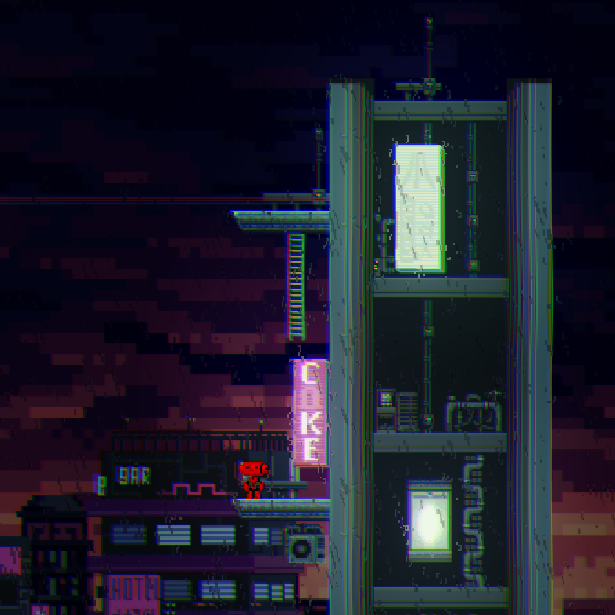

# 2D Platformer

This is a skill-based platformer, created by three Students in a Game Development course.

Language: GDScript
Renderer: GLES 3 (particles are not available in GLES 2)

## Features

- Hard as nails platforming
- Charming, yet disturbing cyberpunk flair

## Screenshots

## Music

NCS Sounds

## Assets

Artwork created by Luis Zuno @ansimuz
